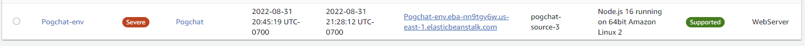

# Pogchat

## What is this?

This is an in-console chat app that connects to a live heroku server. The repo contains the code for both server and client, but startup is assuming you will be using a client.

## Getting started

- Run `NPM i`, then `npm run client` in your console at the root of the directory

## Features

- Chat commands. Input `/help` to see the list of current commands
- Live chatting between any clients connected to the server
- Temporary chat history (Currently up to 100 messages)
- Automatic reconnection when the server fails
- Config file generates on first startup and contains username

## Collaborators

- TEAM:
- Hugo
- Luis
- Zayah
- OTHERS:
- Stackoverflow
- MDN Docs

## AWS Deployment

<http://pogchat-env.eba-nn9tgy6w.us-east-1.elasticbeanstalk.com/>

